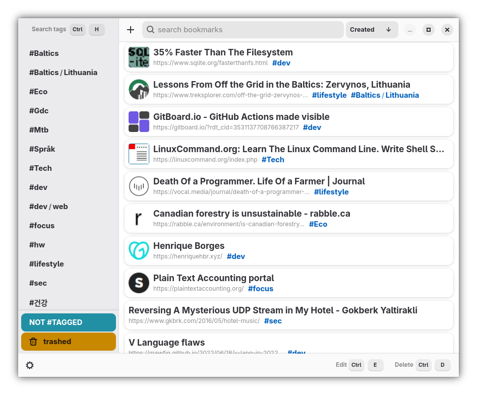
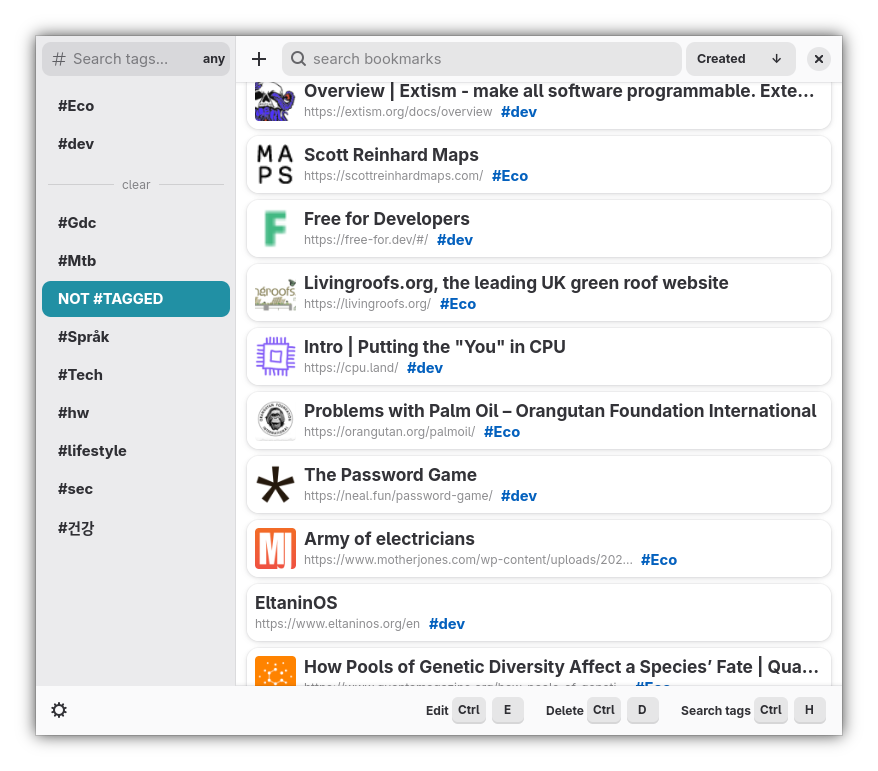
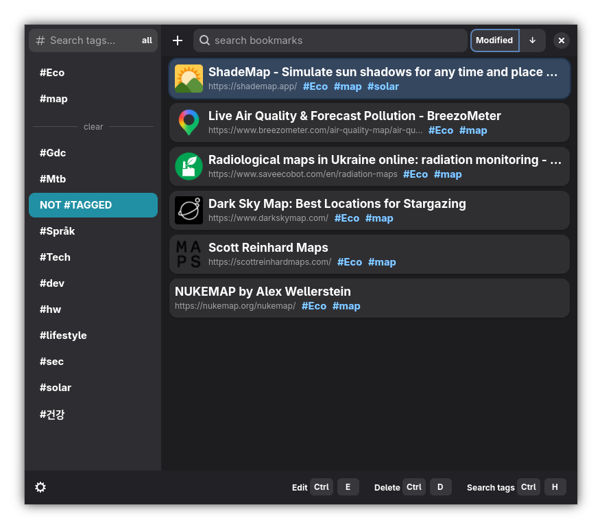
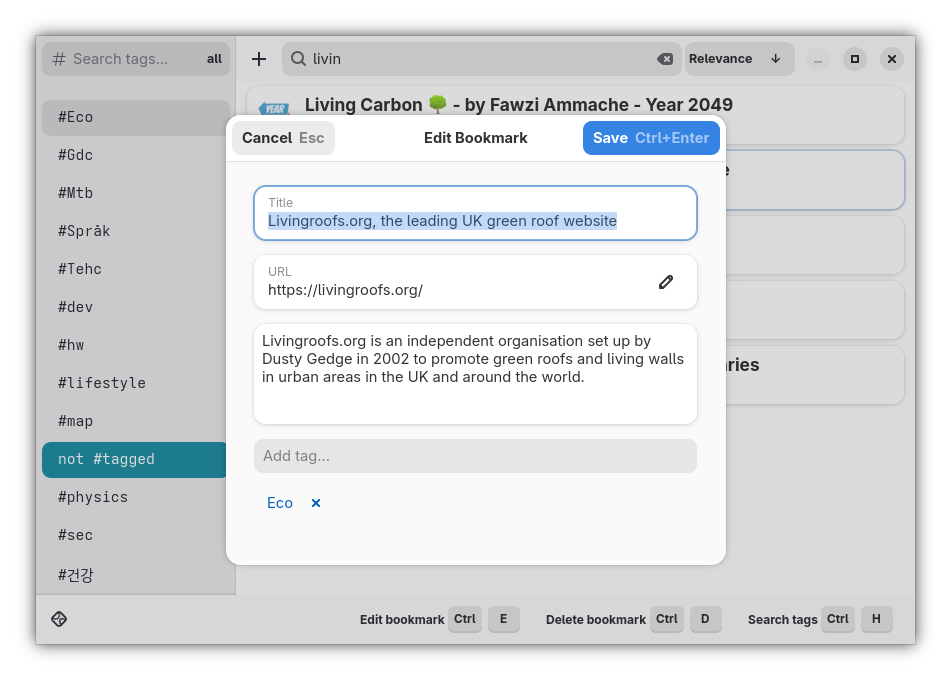

  <h1> Marca</h1>
Find cool stuff you saved to a growing pile of thousands of saved pages and forgot.

| Main screen (dark mode)    | Bookmarks containing *any* pinned tags    |
| ----------------------------------------------- | ------------------------------------------------------------------------------------------ |
| Bookmarks tagged `Eco` & `map` sorted by modified time    | Edit/create bookmark    |
# Features:
- Full Text Search
- Filter using tags inclusively, exclusively
- Sort by `created`, `modified`, `title`, `URL`, `Relevance`
- Keyboard controls
- import from browsers
## Coming soon:
- [ ] nested tags
- [ ] JSON/CSV exports
- [ ] reader mode
- [ ] conflict free syncing - no server self-hosting required
## Coming later:
- [ ] daemon for capturing links
- [ ] compact/grid view
- [ ] mobile app supporting P2P sync
## Needs work:
- [ ] favicon loading
